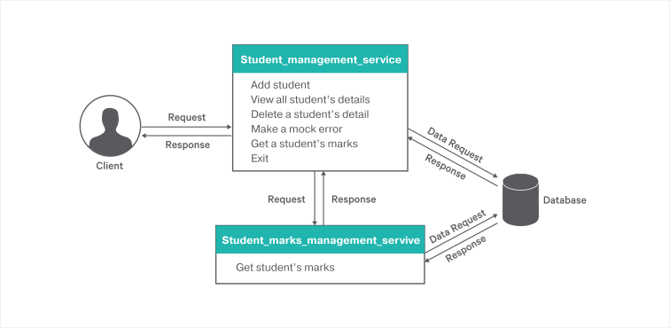
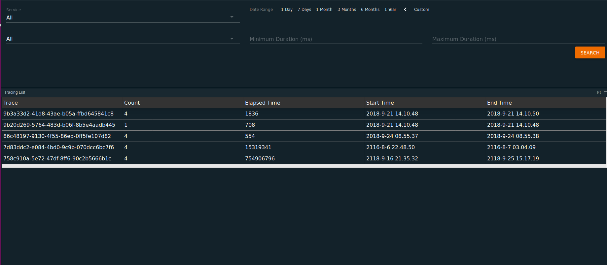
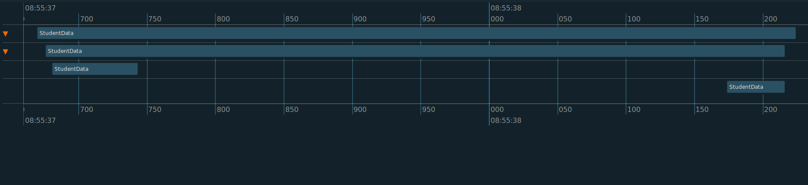
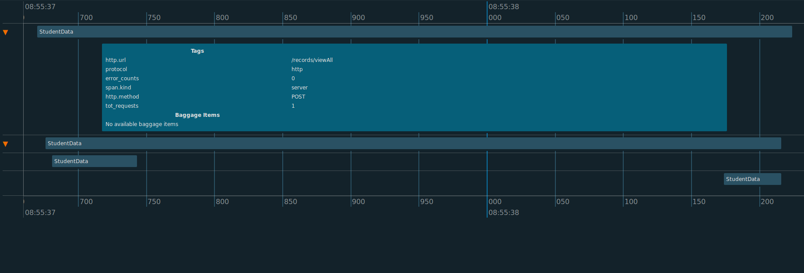
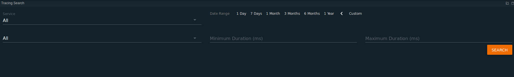
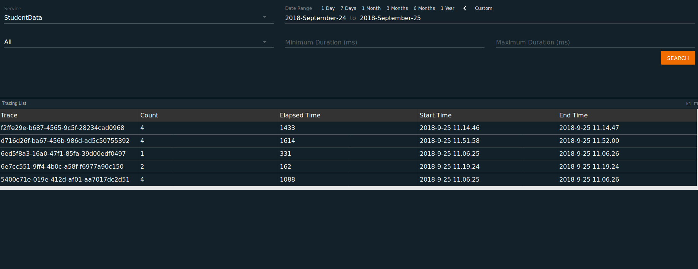
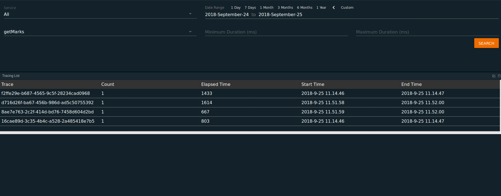

[](https://travis-ci.org/ballerina-guides/message-tracing-with-stream-processor)

# Integration with WSO2 Stream Processor

WSO2 Stream Processor (SP) enables you to perform distributed message tracing. The Distributed Message Tracer allows you to trace the events that are produced, while Ballerina services serve the requests. The Ballerina services send the tracing data as WSO2 events to WSO2 SP.
  >This guide provides instructions on how Ballerina can be used to integrate with Stream-Processor.
  
The following are the sections available in this guide.

- [What you'll build](#what-you’ll-build)
- [Prerequisites](#prerequisites)
- [Implementation](#implementation)
- [Testing](#testing)
- [Testing with distributed message tracing](#testing-with-distributed-message-tracer.)
     - [Traces](#views-of-traces)

## What you’ll build
To perform this integration with Distributed Message Tracer, a real world use case of a very simple student management system is used.
This system illustrates the manipulation of student details in a school/college management system. The administrator is able to perform the following actions in this service.

    - Add a student's details to the system.
    - List down all the student's details who are registered in the system.
    - Delete a student's details from the system by providing student ID.
    - Generate a mock error (for observability purposes).
    - Get a student's marks list by providing student ID.



- **Make Requests** : To perform actions on student management service, a console-based client program has been written in Ballerina for your ease of making requests.

## Prerequisites
 
- [Ballerina Distribution](https://ballerina.io/downloads/)
- [MySQL](https://github.com/ballerina-guides/message-tracing-with-stream-processor/blob/master/resources/testdb.sql)
- [WSO2 - Stream Processor v4.3.0 or above](https://github.com/wso2/product-sp/releases)
- A Text Editor or an IDE 

## Implementation

> If you want to skip the basics, you can download the GitHub repo and continue from the [Testing](#testing) section.

### Implementing database
 1. Start MySQL server in your local machine.
 2. Create a database named `testdb` in your MySQL localhost. If you want to skip the database implementation, then directly import the [testdb.sql](https://github.com/ballerina-guides/message-tracing-with-stream-processor/blob/master/resources/testdb.sql) file into your localhost. You can find it in the GitHub repo.

### Create the project structure
        
 For the purpose of this guide, let's use the following package structure.
 
    message-tracing-with-stream-processor
           └── guide
                ├── students
                │   ├── student_management_service.bal
                │   ├── student_marks_management_service.bal
                ├── client_service
                |         └── client_main.bal
                └── ballerina.conf
        

1. Create the above directories in your local machine, along with the empty `.bal` files.

2. Add the following lines in your [ballerina.conf](https://github.com/ballerina-guides/message-tracing-with-stream-processor/blob/master/ballerina.conf).

```toml
[b7a.observability.tracing]
enabled=true
name="wso2sp"

[b7a.observability.tracing.wso2sp]
reporter.wso2sp.publisher.type="thrift"
reporter.wso2sp.publisher.username="admin"
reporter.wso2sp.publisher.password="admin"
reporter.wso2sp.publisher.url="tcp://localhost:7611"
reporter.wso2sp.publisher.authUrl="ssl://localhost:7711"
reporter.wso2sp.publisher.databridge.agent.config="<SET ABSOLUTE PATH>/data.agent.config.yaml"
javax.net.ssl.trustStore="<SET ABSOLUTE PATH>/wso2carbon.jks"
javax.net.ssl.trustStorePassword="admin"
reporter.wso2sp.publisher.service.name="ballerina_hello_world"
```
- In the ballerina.conf file, the absolute path has to be set for the databridge agent config yaml file and the wso2carbon.jks file in order to configure the databridge agent and the wso2carbon keystore. This wso2carbon keystore configuration is required when the databridge is used.
- These files can be found [here](https://github.com/ballerina-guides/message-tracing-with-stream-processor/tree/master/resources/main/resources).
- Also update the [data.agent.config.yaml](https://github.com/ballerina-guides/message-tracing-with-stream-processor/blob/master/resources/main/resources/data.agent.config.yaml) file by including the absolute path of the [required files](https://github.com/ballerina-guides/message-tracing-with-stream-processor/tree/master/resources/main/resources) in the following fields. This is done for the purpose of configuring security keys for a secured data communication in data agent.
    
  ``
    trustStorePath, keystoreLocation, secretPropertiesFile, masterKeyReaderFile
  ``
  
- Then open the terminal and navigate to `message-tracing-with-stream-processor/guide` and run Ballerina project initializing toolkit in order to initialize this project as Ballerina project.

  ``
     $ ballerina init
  ``
  
- Also clone and build the ballerina-sp-extension in the following repository [https://github.com/ballerina-platform/ballerina-observability/tree/master/tracing-extensions/modules/ballerina-sp-extension](https://github.com/ballerina-platform/ballerina-observability/tree/master/tracing-extensions/modules/ballerina-sp-extension)

- After the build, navigate to `ballerina-sp-extension/target/distribution/` and copy all the JAR files to your `bre/lib` folder in your ballerina distribution.

- Start WSO2 Stream Processor dashboard and worker. Set up [distributed message tracing.](https://docs.wso2.com/display/SP430/Distributed+Message+Tracer)

- Use `admin` as the username and password. Include the following for your business rules.

    ```
    Span stream definition - @source(type='wso2event',  wso2.stream.id="SpanStream:1.0.0",  @map(type='wso2event')) define stream SpanStreamIn (componentName string, traceId  string, spanId long, baggage string, parentId long, operationName string, startMicros long, finishMicros long, tags string, references string);
    Service Name - componentName
    Operation Name - operationName
    Span ID -  convert(spanId, 'string')
    Trace ID - traceId
    Tags - tags
    Baggage Items - baggage
    Start Time - startMicros
    End Time - finishMicros
    Span References - references
    Parent ID - convert(parentId, 'string')
    Parent span is defined - true 
    ```
    
- Leave the rest of the fields as default values in the business rules.

### Development of student and marks service with Stream Processor

Now let us look into the implementation of the student management service with observability.

##### student_management_service.bal

``` ballerina
// Copyright (c) 2018 WSO2 Inc. (http://www.wso2.org) All Rights Reserved.
//
// WSO2 Inc. licenses this file to you under the Apache License,
// Version 2.0 (the "License"); you may not use this file except
// in compliance with the License.
// You may obtain a copy of the License at
//
// http://www.apache.org/licenses/LICENSE-2.0
//
// Unless required by applicable law or agreed to in writing,
// software distributed under the License is distributed on an
// "AS IS" BASIS, WITHOUT WARRANTIES OR CONDITIONS OF ANY
// KIND, either express or implied.  See the License for the
// specific language governing permissions and limitations
// under the License.

import ballerina/http;
import ballerina/io;
import ballerina/log;
import ballerina/mysql;
import ballerina/observe;
import ballerina/runtime;

// Type Student is created to store details of a student.
type Student record {
    int id;
    int age;
    string name;
    int mobNo;
    string address;
};

// Endpoint for marks details client.
http:Client marksServiceEP = new("http://localhost:9191");

// Endpoint for MySQL client.
mysql:Client studentDB = new({
        host: "localhost",
        port: 3306,
        name: "testdb",
        username: "root",
        password: "",
        dbOptions: { useSSL: false }
    });

// Listener of the student service port.
listener http:Listener studentServiceListener = new(9292);

// Service configuration of the student data service..
@http:ServiceConfig {
    basePath: "/records"
}
service studentData on studentServiceListener {
    int errors = 0;
    int requestCounts = 0;

    // Resource configuration for adding students to the system.
    @http:ResourceConfig {
        methods: ["POST"],
        path: "/addStudent"
    }
    // Add Students resource used to add student records to the system.
    resource function addStudents(http:Caller caller, http:Request request) {
        // Initialize an empty HTTP response message.
        studentData.requestCounts += 1;
        http:Response response = new;

        // Accepting the JSON payload sent from a request.
        json|error payloadJson = request.getJsonPayload();

        if (payloadJson is json) {
            //Converting the payload to Student type.
            Student|error studentDetails = Student.convert(payloadJson);

            if (studentDetails is Student) {
                io:println(studentDetails);
                // Calling the function insertData to update database.
                json returnValue = insertData(untaint studentDetails.name, untaint studentDetails.age, untaint studentDetails.mobNo, untaint studentDetails.address);
                response.setJsonPayload(untaint returnValue);
            } else {
                log:printError("Error in converting JSON payload to student type", err = studentDetails);
            }
        } else {
            log:printError("Error obtaining the JSON payload", err = payloadJson);
        }
        // The below function adds tags to be passed as metrics in the message traces. These tags are added to the default system span.
        _ = observe:addTagToSpan("tot_requests", <string>studentData.requestCounts);
        _ = observe:addTagToSpan("error_counts", <string>studentData.errors);

        // Send the response back to the client with the returned JSON value from insertData function.
        var result = caller->respond(response);
        if (result is error) {
            // Log the error for the service maintainers.
            log:printError("Error in sending response to the client", err = result);
        }
    }

    // Resource configuration for viewing details of all the students in the system.
    @http:ResourceConfig {
        methods: ["POST"],
        path: "/viewAll"
    }
    // View students resource is to get all the students details and send to the requested user.
    resource function viewStudents(http:Caller caller, http:Request request) {
        studentData.requestCounts += 1;
        int|error childSpanId = observe:startSpan("Obtain details span");
        http:Response response = new;
        json status = {};
        int spanId2 = observe:startRootSpan("Database call span");

        // Sending a request to MySQL endpoint and getting a response with required data table.
        var returnValue = studentDB->select("SELECT * FROM student", Student, loadToMemory = true);
        _ = observe:finishSpan(spanId2);

        // A table is declared with Student as its type.
        table<Student> dataTable = table{};

        if (returnValue is error) {
           log:printError("Error in fetching students data from the database", err = returnValue);
        } else {
            dataTable = returnValue;
        }

        // Student details displayed on server side for reference purpose.
        foreach var row in dataTable {
            io:println("Student:" + row.id + "|" + row.name + "|" + row.age);
        }

        // Table is converted to JSON.
        var jsonConversionValue = json.convert(dataTable);
        if (jsonConversionValue is error) {
            log:printError("Error in converting the data from a tabular format to JSON.", err = jsonConversionValue);
        } else {
            status = jsonConversionValue;
        }
        // Sending back the converted JSON data to the request made to this service.
        response.setJsonPayload(untaint status);
        var result = caller->respond(response);
        if (result is error) {
            log:printError("Error in sending the response", err = result);
        }

        if (childSpanId is int) {
            _ = observe:finishSpan(childSpanId);
        } else {
            log:printError("Error attaching span ", err = childSpanId);
        }
        //The below function adds tags to be passed as metrics in the message traces. These tags are added to the default system span.
        _ = observe:addTagToSpan("tot_requests", <string>studentData.requestCounts);
        _ = observe:addTagToSpan("error_counts", <string>studentData.errors);
    }

    // Resource configuration for making a mock error to the system.
    @http:ResourceConfig {
        methods: ["GET"],
        path: "/testError"
    }
    // Resource to generate a mock error for testing purposes.
    resource function testError(http:Caller caller, http:Request request) {
        studentData.requestCounts += 1;
        http:Response response = new;
        studentData.errors += 1;
        io:println(studentData.errors);
        // The below function adds tags to be passed as metrics in the message traces. These tags are added to the default system span.
        _ = observe:addTagToSpan("tot_requests", <string>studentData.requestCounts);
        _ = observe:addTagToSpan("error_counts", <string>studentData.errors);
        log:printError("error test");
        response.setTextPayload("Test Error made");
        var result = caller->respond(response);
        if (result is error) {
            log:printError("Error in sending response to the client", err = result);
        }
    }

    // Resource configuration for deleting the details of a student from the system.
    @http:ResourceConfig {
        methods: ["GET"],
        path: "/deleteStu/{studentId}"
    }
    // Delete Students resource for deleteing a student using id.
    resource function deleteStudent(http:Caller caller, http:Request request, int studentId) {
        studentData.requestCounts += 1;
        http:Response response = new;
        json status = {};

        // Calling the deleteData function with the studentId as the parameter and getting a JSON object returned.
        var returnValue = deleteData(studentId);
        io:println(returnValue);

        // Pass the obtained JSON object to the request.
        response.setJsonPayload(returnValue);
        var result = caller->respond(response);
        if (result is error) {
            log:printError("Error in sending response to the client", err = result);
        }
        // The below function adds tags to be passed as metrics in the message traces. These tags are added to the default system span.
        _ = observe:addTagToSpan("tot_requests", <string>studentData.requestCounts);
        _ = observe:addTagToSpan("error_counts", <string>studentData.errors);
    }

    // Resource configuration for getting the marks of a particular student.
    @http:ResourceConfig {
        methods: ["GET"],
        path: "/getMarks/{studentId}"
    }
    // Get marks resource for obtaining marks of a particular student.
    resource function getMarks(http:Caller caller, http:Request request, int studentId) {
        studentData.requestCounts += 1;
        http:Response response = new;
        json result = {};

        // Self-defined span for observability purposes.
        int|error firstSpan = observe:startSpan("First span");
        // Request to be sent to the to marks Service for obtaining the marks of the student with the respective studentId.
        var requestReturn = marksServiceEP->get("/marks/getMarks/" + untaint studentId);
        if (requestReturn is error) {
            log:printError("Error in fetching marks from the system.", err = requestReturn);
        } else {
            var msg = requestReturn.getJsonPayload();
            if (msg is error) {
                log:printError("Error in extracting the JSON payload from the response", err = msg);
            } else {
                result = msg;
            }
        }

        // Stopping the previously started span.
        if (firstSpan is int) {
            _ = observe:finishSpan(firstSpan);
        } else {
            log:printError("Error attaching span ", err = firstSpan);
        }
        //Sending the JSON to the client.
        response.setJsonPayload(untaint result);
        var resResult = caller->respond(response);
        if (resResult is error) {
            log:printError("Error in sending response to the client", err = resResult);
        }
        // The below function adds tags to be passed as metrics in the message traces. These tags are added to the default system span.
        _ = observe:addTagToSpan("tot_requests", <string>studentData.requestCounts);
        _ = observe:addTagToSpan("error_counts", <string>studentData.errors);
    }
}

// Function to insert values to the database..
# `insertData()` is a function to add data to student records database.
#
# + name - This is the name of the student to be added.
# + age -Student age.
# + mobNo -Student mobile number.
# + address - Student address.
# + return - This function returns a JSON object. If data is added it returns JSON containing a status and id of student
#            added. If data is not added , it returns the JSON containing a status and error message.

public function insertData(string name, int age, int mobNo, string address) returns (json) {
    json updateStatus = { "Status": "Data Inserted " };
    int uniqueId = 0;
    string sqlString = "INSERT INTO student (name, age, mobNo, address) VALUES (?,?,?,?)";

    // Insert data to SQL database by invoking update action.
    var returnValue = studentDB->update(sqlString, name, age, mobNo, address);
    if (returnValue is int) {
        table<Student> result = getId(untaint mobNo);
        while (result.hasNext()) {
            var returnValue2 = result.getNext();
            if (returnValue2 is Student) {
                uniqueId = returnValue2.id;
            } else {
                log:printError("Error in obtaining a student ID from the database for the added student.", err = returnValue2);
            }
        }

        if (uniqueId != 0) {
            updateStatus = { "Status": "Data Inserted Successfully", "id": uniqueId };
        } else {
            updateStatus = { "Status": "Data Not inserted" };
        }
    } else {
        log:printError("Error in adding the data to the database", err = returnValue);
    }
    return updateStatus;
}

# Function to delete data of a student from the database..
# `deleteData()` is a function to delete a student's data from student records database.
#
# + studentId - This is the id of the student to be deleted.
# + return -This function returns a JSON object. If data is deleted it returns JSON containing a status.
#           If data is not deleted , it returns the JSON containing a status and error message.

public function deleteData(int studentId) returns (json) {
    json status = {};
    string sqlString = "DELETE FROM student WHERE id = ?";

    // Invoking an update action to delete existing data from the database.
    var returnValue = studentDB->update(sqlString, studentId);
    io:println(returnValue);

    if (returnValue is int) {
        if (returnValue != 1) {
            status = { "Status": "Data Not Found" };
        } else {
            status = { "Status": "Data Deleted Successfully" };
        }

    } else {
        log:printError("Error in removing data from the database", err = returnValue);
        status = { "Status": "Data Not Deleted" };
    }
    return status;
}

# `getId()` is a function to get the Id of the student added in latest.
#
# + mobNo - This is the mobile number of the student added which is passed as parameter to build up the query.
# + return -This function returns a table with Student type.

// Function to get the generated Id of the student recently added.
public function getId(int mobNo) returns table<Student> {
    //Select data from database by invoking select action.

    string sqlString = "SELECT * FROM student WHERE mobNo = ?";
    // Retrieve student data by invoking select remote function defined in ballerina sql client
    var returnValue = studentDB->select(sqlString, Student, mobNo);

    table<Student> dataTable = table{};
    if (returnValue is error) {
        log:printError("Error in obtaining the student ID from the database to retrieve the marks of the student.
        ", err = returnValue);
    } else {
        dataTable = returnValue;
    }
    return dataTable;
}

```

Now we will look into the implementation of obtaining the marks of the students from database through another service.

##### student_marks_management_service.bal

``` ballerina
// Copyright (c) 2018 WSO2 Inc. (http://www.wso2.org) All Rights Reserved.
//
// WSO2 Inc. licenses this file to you under the Apache License,
// Version 2.0 (the "License"); you may not use this file except
// in compliance with the License.
// You may obtain a copy of the License at
//
// http://www.apache.org/licenses/LICENSE-2.0
//
// Unless required by applicable law or agreed to in writing,
// software distributed under the License is distributed on an
// "AS IS" BASIS, WITHOUT WARRANTIES OR CONDITIONS OF ANY
// KIND, either express or implied.  See the License for the
// specific language governing permissions and limitations
// under the License.

import ballerina/http;
import ballerina/io;
import ballerina/log;
import ballerina/mysql;
import ballerina/observe;
import ballerina/runtime;

// Type Marks is created to represent a set of marks.
type Marks record {
    int studentId;
    int maths;
    int english;
    int science;
};

// Listener for the port of the marks service.
listener http:Listener marksServiceListener = new(9191);

// Service configuration of the marks service.
@http:ServiceConfig {
    basePath: "/marks"
}
service MarksData on marksServiceListener {
    // Resource configuration for retrieving the marks of a student from the system.
    @http:ResourceConfig {
        methods: ["GET"],
        path: "/getMarks/{stuId}"
    }
    // Resource used to get student's marks.
    resource function getMarks(http:Caller caller, http:Request request, int stuId) {
        http:Response response = new;
        json result = findMarks(untaint stuId);
        // Pass the obtained JSON object to the requested client.
        response.setJsonPayload(untaint result);
        var resResult = caller->respond(response);
        if (resResult is error) {
            log:printError("Error in sending response to the client", err = resResult);
        }
    }
}

# `findMarks()`is a function to find a student's marks from the marks record database.
#
#  + stuId -  This is the id of the student.
# + return - This function returns a JSON object. If data is added it returns JSON containing a status and id of student added.
#            If data is not added , it returns the JSON containing a status and error message.

public function findMarks(int stuId) returns (json) {
    json status = {};
    string sqlString = "SELECT * FROM marks WHERE student_Id = " + stuId;
    // Getting student marks of the given ID.
    // Invoking select operation in testDB.
    var returnValue = studentDB->select(sqlString, Marks, loadToMemory = true);
    // Assigning data obtained from db to a table.
    table<Marks> dataTable = table {};
    if (returnValue is table<Marks>) {
        dataTable = returnValue;
    } else {
        log:printError("Error in fetching the data table from the database", err = returnValue);
        status = { "Status": "Select data from student table failed: " };
        return status;
    }
    // Converting the obtained data in table format to JSON data.
    var jsonConversionValue = json.convert(dataTable);

    if (jsonConversionValue is json) {
        status = jsonConversionValue;
    } else {
        status = { "Status": "Data Not available" };
        log:printError("Error in converting the fetched data from tabular format to JSON.", err = jsonConversionValue);
    }
    return status;
}

```

Lets look into the implementation of the client implementation.

##### client_main.bal

``` ballerina
// Copyright (c) 2018 WSO2 Inc. (http://www.wso2.org) All Rights Reserved.
//
// WSO2 Inc. licenses this file to you under the Apache License,
// Version 2.0 (the "License"); you may not use this file except
// in compliance with the License.
// You may obtain a copy of the License at
//
// http://www.apache.org/licenses/LICENSE-2.0
//
// Unless required by applicable law or agreed to in writing,
// software distributed under the License is distributed on an
// "AS IS" BASIS, WITHOUT WARRANTIES OR CONDITIONS OF ANY
// KIND, either express or implied.  See the License for the
// specific language governing permissions and limitations
// under the License.

import ballerina/http;
import ballerina/io;
import ballerina/log;

// Host name of the server hosting the student administration system.
http:Client studentService = new("http://localhost:9292");

public function main() {
    http:Request req = new;
    int operation = 0;
    while (operation != 6) {
        // Print options menu to choose from.
        io:println("Select operation.");
        io:println("1. Add student");
        io:println("2. View all students");
        io:println("3. Delete a student");
        io:println("4. Make a mock error");
        io:println("5: Get a student's marks");
        io:println("6. Exit \n");

        // Read user's choice.
        string choice = io:readln("Enter choice 1 - 5: ");
        if (!isInteger(choice)) {
            io:println("Choice must be of a number");
            io:println();
            continue;
        }
        var intOperation = int.convert(choice);
        if (intOperation is int) {
            io:println(intOperation);
            operation = intOperation;
        } else {
            log:printError("Error in converting the option selected by the user to an integer.", err = intOperation);
        }
        // Program runs until the user inputs 6 to terminate the process.
        match operation {
            1 => addStudent(req);
            2 => viewAllStudents();
            3 => deleteStudent();
            4 => makeError();
            5 => getMarks();
            6 => break;
            _ => io:println("Invalid choice");
        }
    }
}

// Function to check if the input is an integer.
function isInteger(string input) returns boolean {
    string regEx = "\\d+";
    boolean|error isInt = input.matches(regEx);
    if (isInt is error) {
        log:printError("Error in checking if the type of the input variable is integer", err = isInt);
        return false;
    } else {
        return isInt;
    }

}

// Function to add details of a student to the database.
function addStudent(http:Request req) {
    // Get student name, age mobile number, address.
    var name = io:readln("Enter Student name: ");
    var age = io:readln("Enter Student age: ");
    var mobile = io:readln("Enter mobile number: ");
    var add = io:readln("Enter Student address: ");
    var ageAsInt = int.convert(age);
    var mobNoAsInt = int.convert(mobile);

    if (ageAsInt is int && mobNoAsInt is int) {
        // Create the request as JSON message.
        json jsonMsg = { "name": name, "age": ageAsInt, "mobNo": mobNoAsInt, "address": add, "id": 0 };
        req.setJsonPayload(jsonMsg);

    } else {
        log:printError("Error in converting the age and the mobile number to integers.", err = ageAsInt);
        return;
    }

    // Sending the request to the students service and getting the response from it.
    var resp = studentService->post("/records/addStudent", req);

    if (resp is http:Response) {
        // Extracting data from the received JSON object..
        var jsonMsg = resp.getJsonPayload();
        if (jsonMsg is json) {
            string message = "Status: " + jsonMsg["Status"] .toString() + " Added Student Id :- " +
                jsonMsg["id"].toString();
            io:println(message);
        } else {
            log:printError("Error in extracting the JSON payload from the response.", err = jsonMsg);
        }
    } else {
        log:printError("Error in the obtained response", err = resp);
    }
}

// Function to view details of all the students.
function viewAllStudents() {
    // Sending a request to list down all students and get the response from it.
    var response = studentService->post("/records/viewAll", null);
    if (response is http:Response) {
        var jsonMsg = response.getJsonPayload();

        if (jsonMsg is json) {
            string message = "";

            if (jsonMsg.length() >= 1) {
                int i = 0;
                while (i < jsonMsg.length()) {

                    message = "Student Name: " + jsonMsg[i]["name"] .toString() + ", " + " Student Age: " +
                        jsonMsg[i]["age"] .toString();

                    io:println(message);
                    i += 1;
                }
            } else {
                // Notify user if no records are available.
                message = "\n Student record is empty";
                io:println(message);
            }

        } else {
            log:printError("Error in extracting JSON from response", err = jsonMsg);
        }

    } else {
        log:printError("Error in obtained response", err = resp);
    }
}

// Function to delete a student's data from the system.
function deleteStudent() {
    // Get student id.
    string id = io:readln("Enter student id: ");

    // Request made to find the student with the given id and get the response from it.
    var resp = studentService->get("/records/deleteStu/" + id);

    if (resp is http:Response) {
        var jsonMsg = resp.getJsonPayload();
        if (jsonMsg is json) {
            string message = jsonMsg["Status"].toString();
            io:println("\n" + message + "\n");
        } else {
            log:printError("Error in extracting JSON from response", err = jsonMsg);
        }
    } else {
        log:printError("Error in obtained response", err = resp);
    }

}

// Function to generate a mock error in the system for observability purposes.
function makeError() {
    var response = studentService->get("/records/testError");
    if (response is http:Response) {
        var msg = response.getTextPayload();
        if (msg is string) {
            io:println("\n" + msg + "\n");
        } else {
            log:printError("Error in fetching text from the response", err = msg);
        }
    } else {
        log:printError("Error in the obtained response", err = response);
    }
}

// Function to fetch marks of a student from the system.
function getMarks() {
    // Gets the student ID.
    var id = io:readln("Enter student id: ");
    // Request made to get the marks of the student with given id and get the response from it.
    var response = studentService->get("/records/getMarks/" + id);
    if (response is http:Response) {
        var jsonMsg = response.getJsonPayload();
        if (jsonMsg is json) {
            string message = "";
            // Validate to check if student with given ID exist in the system.
            if (jsonMsg.length() >= 1) {
                message = "Maths: " + jsonMsg[0]["maths"] .toString() + " English: " + jsonMsg[0]["english"] .toString()
                    +
                    " Science: " + jsonMsg[0]["science"] .toString();
            } else {
                message = "Data not available. Check if student's mark is added or student might not be in our system.";
            }
            io:println("\n" + message + "\n");
        } else {
            log:printError("Error in extracting the JSON payload from the response.", err = jsonMsg);
        }
    } else {
        log:printError("Error in the obtained response ", err = response);
    }
}

```

- Now we have completed the implementation of student management service with marks management service.

## Testing 

### Invoking the student management service

To start both services, open a terminal tab, navigate to message-tracing-with-stream-processor/guide, and execute the following command.

```
$ ballerina run --config <path-to-conf>/ballerina.conf students
```

- You need to start the WSO2 Stream Processor dashboard and worker and navigate to the portal page. Here again use `admin` for both the username and password.

 You can observe the service performance by making some http requests to the above services. This is made easy for you as 
 there is a client program implemented. You can start the client program by opening another terminal and navigating to message-tracing-with-stream-processor/guide
 and execute the below command..
 
 ```
 $ ballerina run client_service
 ``` 
 
### Testing with Distributed Message Tracer.
 
#### Views of traces
 After making some HTTP requests, go to the distributed message tracing dashboard in your WSO2 Stream Processor portal.

 - To view the message traces as indicated below, click the `Search` button in the Dashboard.
 
[](https://github.com/ballerina-guides/message-tracing-with-stream-processor/blob/master/images/trace1.png)
 
 - To view a particular trace, click on the row of it. You will view the following.
 
[](https://github.com/ballerina-guides/message-tracing-with-stream-processor/blob/master/images/trace2.png)
    
 - To view span details with the metrics as shown below, click on a particular span.

[](https://github.com/ballerina-guides/message-tracing-with-stream-processor/blob/master/images/trace3.png)

 To filter the received message traces, enter the service name, time, and/or resource name in the search box.

 - Tracing search -
  
[](https://github.com/ballerina-guides/message-tracing-with-stream-processor/blob/master/images/trace6.png)
  
 - Filter using service name and time -

[](https://github.com/ballerina-guides/message-tracing-with-stream-processor/blob/master/images/trace5.png)
     
 - Filter using resource name and time -

[](https://github.com/ballerina-guides/message-tracing-with-stream-processor/blob/master/images/trace4.png)
